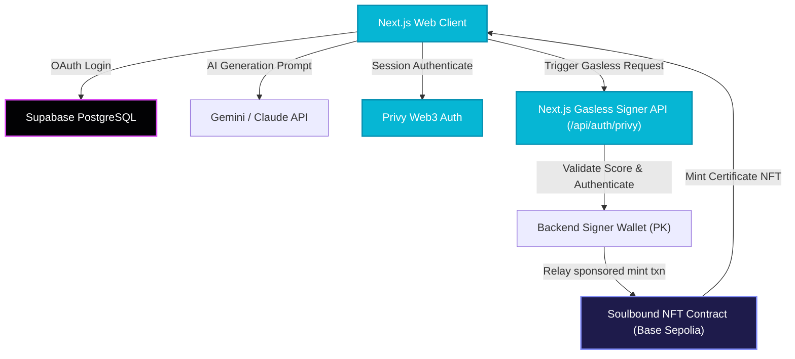

# ⚡ Skillage

> **Next-Gen Onchain Credentials Powered by AI evaluations and Gasless Soulbound NFTs.**

---

## 🌌 Introduction

Skillage is a decentralized micro-learning dApp deployed on **Base Sepolia**. It empowers developers and students to learn anything under the sun, evaluate their knowledge with customized AI evaluations, and cryptographically prove their mastery onchain using official gasless **Soulbound NFT certificates**—with zero gas fees or native ETH required.

```
+-----------------------------------------------------------------+
|                           SKILLAGE HUB                          |
|                                                                 |
|  [ Topic Search ] ---> [ AI Synthesized ] ---> [ MCQ Quiz ]     |
|                             Curriculum           (≥ 80% score)  |
|                                 |                       |       |
|                                 v                       v       |
|  [ Onchain Verification ] <--- [ Soulbound NFT ] <--- [ Pass! ] |
|     (Public Portal)            (Gasless Mint)                   |
+-----------------------------------------------------------------+
```

---

## 🎨 Premium Cybersecurity Aesthetics

Skillage is styled under a dark obsidian-glass cyberpunk theme inspired by modern premium award-winning developer portfolios:
- **Cosmic Color System**: Multi-layered background grids, cosmic-radial glows (`#020204`), and high-tech cyber-cyan (`#06b6d4`) / bright violet (`#d946ef`) accents.
- **HUD HUD Glass Cards**: Glassmorphic dashboards (`backdrop-filter`) with glowing border gradients and micro-animated lifting effects.
- **Holographic Scanners**: Immersive empty-state panels with responsive custom inline keyframe laser scanners that sweep across verified portals.

---

## ⚡ Core Features

- 🧠 **Infinite AI Learning Modules**: Enter any topic (e.g., *Rust Futures*, *Quantum Computing*, *Zero-Knowledge Proofs*). The Gemini/Claude compiler synthesizes structured reading material, code examples, and resources instantly.
- 🎯 **Claude-Graded MCQ Evaluations**: Complete a balanced, multi-question test tailored to your topic and difficulty setting.
- 🔗 **Privy Unified Auth**: Supports secure wallet onboarding. Seamlessly swaps between a generic **"Connect Wallet"** button and an interactive mono-address chip with direct block explorer redirects.
- 📜 **Gasless Soulbound NFTs (ERC-721)**: Earned certificates are cryptographically bound to your wallet. Gas is sponsored by a secure backend signer wallet, making the user experience friction-free.
- 📊 **Dynamic Student Dashboard**: Detailed analytics panel visualizing:
  - *Total Quizzes Attempted*
  - *Earned NFTs*
  - *Average Scores*
  - *Passing Rates*
- 🔍 **Public Credential Cabinet**: Publicly shareable verification links (`/verify/[address]`) displaying an authenticated onchain resume for employers.

---

## 🛠️ Architecture & System Design



---

## 💻 Technology Stack

| Layer | Technology | Purpose |
| :--- | :--- | :--- |
| **Core Architecture** | Next.js (Turbopack, App Router) | Modular Client/Server routing & optimized build times |
| **Styling Systems** | Vanilla CSS, TailwindCSS, Lucide Icons | Responsive Glassmorphic Cyberpunk HUD layouts |
| **Identity & Wallet** | Privy Web3 Provider, Supabase Auth | Universal Google OAuth and multi-chain wallet sessions |
| **AI Evaluation** | Gemini / Anthropic APIs | Tailored lesson generation and quiz grading |
| **Persistence** | Supabase Database (PostgreSQL) | Dynamic student attempt logs and course progress tracking |
| **Smart Contracts** | Solidity (ERC-721, OpenZeppelin) | Soulbound non-transferable cryptographic credentials |
| **Network Node** | Base Sepolia Testnet | High speed, scalable, low cost layer-2 ecosystem |

---

## ⚙️ Environment Configuration

Create a secure `.env.local` file in your root directory and supply the following parameters:

```env
# Privy Auth Providers
NEXT_PUBLIC_PRIVY_APP_ID=cmpee4fmo005n0clbs8xouegq

# Deployed Smart Contract Target
CONTRACT_ADDRESS=0x1707aC9798c67BDf3a50112b7f9E7f8d3dEac377
NEXT_PUBLIC_CONTRACT_ADDRESS=0x1707aC9798c67BDf3a50112b7f9E7f8d3dEac377

# Gemini API Key (Lesson synthesis & quiz generation)
GEMINI_API_KEY=AIzaSyBQ_...

# Backend Relayer Signer Wallet (Pays gas for NFT mints on Base Sepolia)
BACKEND_SIGNER_PK=0x83a78e9...

# Supabase PostgreSQL Database URI
MONGODB_URI=mongodb+srv://...

# Cryptographic Session Encryption
SESSION_SECRET=0a148a74c7c1f8c...

# Base Sepolia Network Parameters
RPC_URL=https://sepolia.base.org
NEXT_PUBLIC_CHAIN_ID=84532
```

---

## 🏃 Getting Started & Execution

1. **Install dependencies**:
   ```bash
   pnpm install
   ```

2. **Boot the high-performance local dev server**:
   ```bash
   pnpm dev
   ```

3. **Visit the Skillage hub in your browser**:
   Navigate to [http://localhost:3000](http://localhost:3000)

4. **Verify codebase formatting and static types**:
   ```bash
   pnpm lint
   ```

---

## ⚖️ Smart Contract & Gasless Relaying

The Soulbound Certificate NFT contract is designed to be fully non-transferable (transfer overrides revert). The backend signer wallet (`BACKEND_SIGNER_PK`) is registered as the contract operator or holds secure signature verification rights, authorizing the contract to sponsor minting transactions whenever a user completes a course evaluation with a **passing score of 80% or above**.

---

## 🛡️ License & Attributions
Built with ⚡ on Base. Open source under the MIT License.
